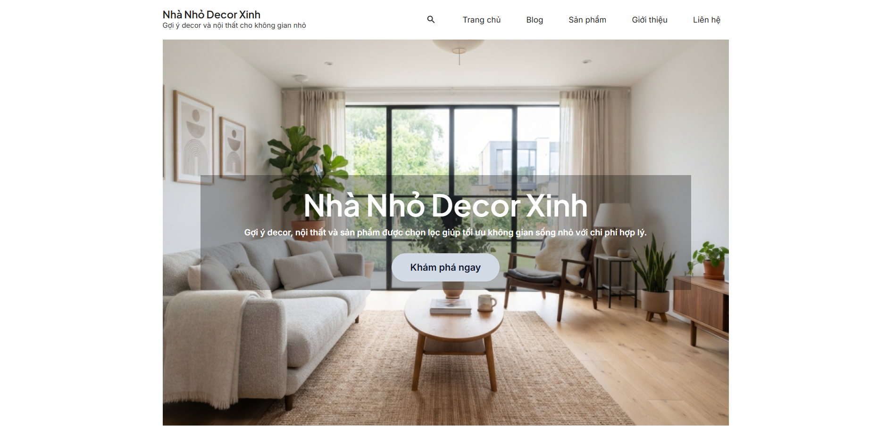
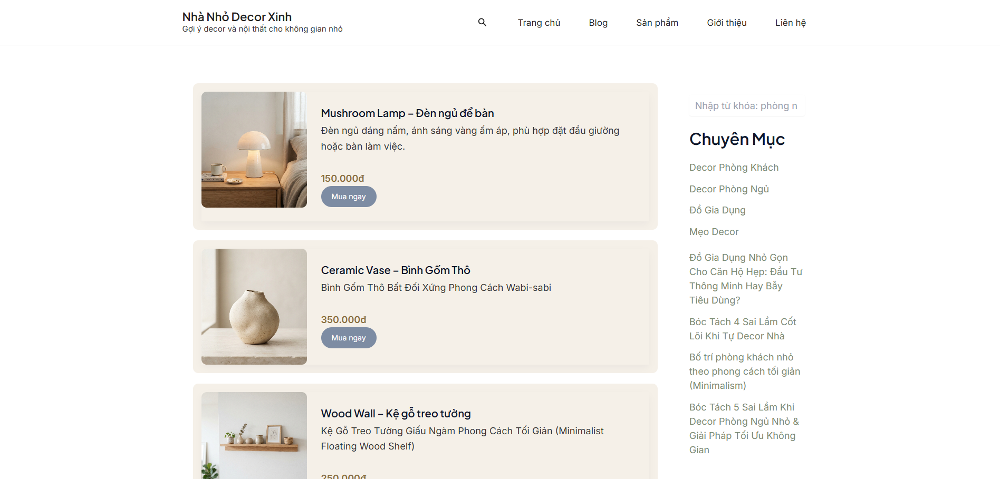
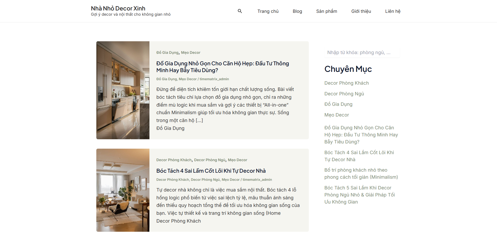
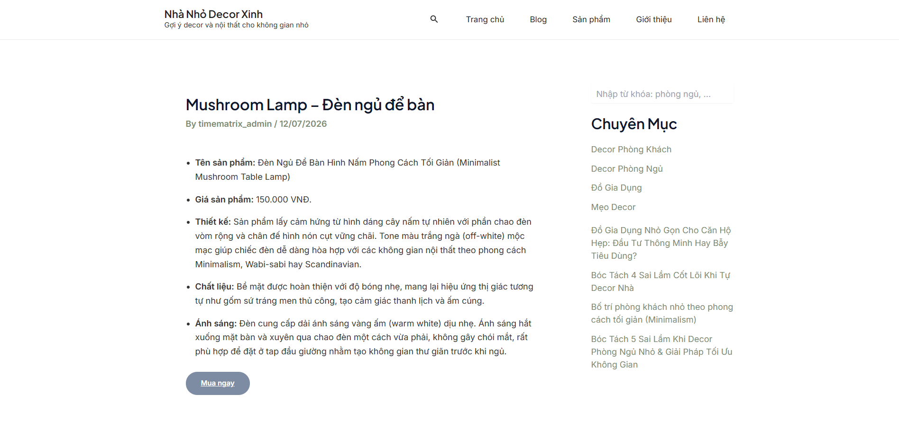

# Bài tập lớn 1 - WordPress
# Nhà Nhỏ Decor Xinh

Website affiliate marketing về decor nội thất, xây dựng trên nền tảng WordPress kết hợp lập trình PHP tùy chỉnh (Custom Post Type, Custom Fields, Shortcode, Hook/Filter). Đồ án môn học WordPress + PHP.

**Demo:** https://timematrix.io.vn

---

## Giới thiệu chủ đề

Nhà Nhỏ Decor Xinh là website chia sẻ ý tưởng decor, nội thất và gợi ý sản phẩm cho những không gian sống nhỏ gọn — hướng tới sinh viên, người trẻ mới sống độc lập. Website vừa đáp ứng yêu cầu học thuật (WordPress + PHP), vừa được thiết kế theo hướng có thể phát triển thành sản phẩm Affiliate Marketing thực tế.

### Ảnh giao diện

| Trang chủ | Trang Sản phẩm |
|---|---|
|  |  |

| Trang Blog | Trang chi tiết sản phẩm |
|---|---|
|  |  |

---

## Công nghệ sử dụng

- **CMS:** WordPress
- **Theme:** Astra + Astra Child Theme (tùy chỉnh riêng)
- **Ngôn ngữ:** PHP, CSS, HTML
- **Plugin:** Elementor, Rank Math SEO, LiteSpeed Cache, WPForms, Smush, TablePress, ThirstyAffiliates
- **Hosting:** TenTen (DirectAdmin), tên miền `.io.vn`

---

## Các giai đoạn thực hiện

### Giai đoạn 1 — Hạ tầng (Domain, Hosting, SSL)

- Đăng ký tên miền `timematrix.io.vn`, kích hoạt hosting TenTen
- Trỏ DNS tên miền về hosting, xác minh bằng `nslookup` qua DNS Google (8.8.8.8) và Cloudflare (1.1.1.1)
- Cài đặt SSL certificate qua DirectAdmin, chuyển website sang HTTPS

### Giai đoạn 2 — Cài đặt WordPress

- Tạo Database MySQL qua DirectAdmin
- Cài đặt WordPress, cấu hình kết nối Database
- Thiết lập tài khoản quản trị, ẩn website khỏi công cụ tìm kiếm trong giai đoạn xây dựng

### Giai đoạn 3 — Theme và Plugin

- Cài đặt theme **Astra**
- Cấu hình cơ bản: Site Identity, Container Width, Sidebar, Header/Footer
- Cài đặt plugin: Elementor, Rank Math SEO, LiteSpeed Cache, WPForms, Smush, TablePress, ThirstyAffiliates
- Gỡ bỏ plugin không cần thiết (Hello Dolly, Akismet)

### Giai đoạn 4 — Lập trình PHP tùy chỉnh (trọng tâm đồ án)

Toàn bộ code nằm trong `wp-content/themes/astra-child/functions.php`.

- **Astra Child Theme**: tách riêng để tùy biến an toàn, không ảnh hưởng theme gốc khi cập nhật
- **Custom Post Type `san_pham_aff`**: đăng ký loại nội dung "Sản phẩm Affiliate" riêng biệt với Post/Page mặc định, có archive riêng tại `/san-pham/`
- **Custom Fields**: `gia-tien` (giá sản phẩm), `link-san-pham` (link affiliate gốc) — truy xuất bằng `get_post_meta()`
- **Shortcode**:
  - `[san_pham_noi_bat so_luong="6"]` — hiển thị lưới sản phẩm nổi bật (Grid 3 cột), dùng `WP_Query`
  - `[san_pham_hot so_luong="-1"]` — hiển thị carousel trượt ngang, kèm nút điều hướng bằng JavaScript thuần
- **Hook & Filter**:
  - `add_filter('the_excerpt', ...)` — tự động chèn Giá + nút "Mua ngay" vào trang danh sách sản phẩm
  - `add_filter('the_content', ...)` — tự động chèn Giá + nút "Mua ngay" vào trang chi tiết sản phẩm

### Giai đoạn 5 — Thiết kế giao diện

- Xây dựng Trang chủ bằng Gutenberg (Block Editor): Hero Banner (ảnh nền full-width), Sản phẩm nổi bật, Bài viết mới nhất, Sản phẩm đang Hot
- Tùy chỉnh Header/Footer, đồng bộ màu sắc, bố cục qua Additional CSS
- Thiết kế trang Sản phẩm dạng danh sách (List): ảnh bên trái — nội dung, giá, nút mua bên phải
- Thiết kế trang Blog dạng Grid, phân loại theo Category

### Giai đoạn 6 — Nội dung

- Tạo 6 sản phẩm mẫu với đầy đủ ảnh, mô tả, giá, link affiliate
- Viết 8 bài blog theo các chuyên mục: Decor Phòng Khách, Decor Phòng Ngủ, Đồ Gia Dụng, Mẹo Decor
- Hoàn thiện nội dung trang Giới thiệu, Liên hệ (tích hợp form WPForms)

### Giai đoạn 7 — Kiểm thử và tối ưu

- Kiểm tra toàn bộ menu, liên kết nội bộ, không còn lỗi 404
- Kiểm tra responsive trên nhiều kích thước màn hình
- Purge cache (LiteSpeed Cache), tối ưu tốc độ tải trang
- Kiểm thử form Liên hệ, luồng bấm "Mua ngay" dẫn tới link affiliate

---

## Additional CSS (Custom Style)

Toàn bộ CSS tùy chỉnh giao diện (Header, Footer, Hero Banner, layout trang Sản phẩm, hiệu ứng...) được dán trực tiếp vào **Appearance → Customize → Additional CSS** của WordPress (không nằm trong file `style.css` của Child Theme, vì đây là CSS do WordPress Customizer quản lý riêng, lưu trong Database).

Thư mục được lưu tại: wp-content\themes\astra-child\assets\css\additional-css.css
---

## Cấu trúc thư mục

```
astra-child/
├── style.css                    # Khai báo Child Theme
├── functions.php                # Toàn bộ logic PHP: CPT, Custom Fields, Shortcode, Hook
├── assets/
│   └── css/
│       └── additional-css.css   # Lưu trữ nội dung ô Additional CSS (Customizer)
└── screenshots/                 # Ảnh giao diện minh họa (tự thêm)
```

---

## Hướng phát triển tiếp theo

- Tích hợp cổng thanh toán / theo dõi click affiliate
- Hệ thống đánh giá, bình luận sản phẩm
- Tối ưu SEO chuyên sâu (Schema, sitemap nâng cao)
- Chuyển sang hosting có tài nguyên cao hơn để hỗ trợ tốt các tính năng động

---

## Tác giả

Đồ án môn học WordPress + PHP — 2026