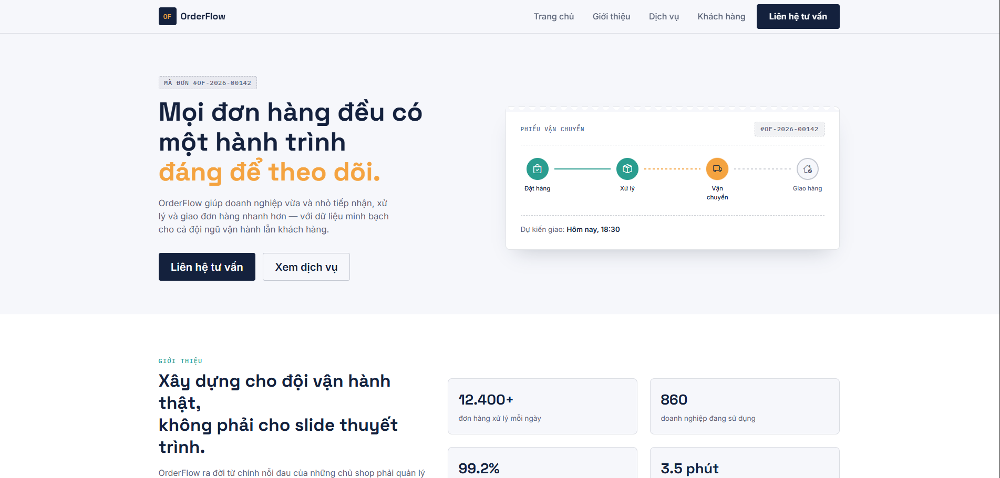
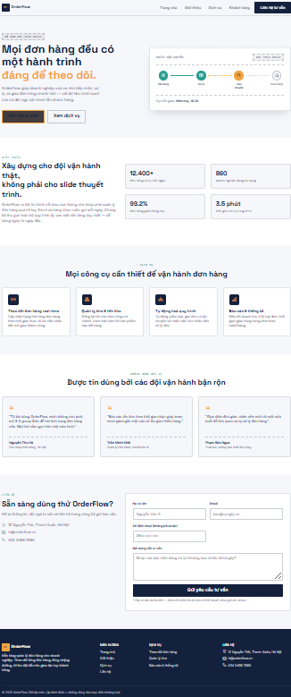

# OrderFlow — Landing Page (Bản tĩnh thuần HTML/CSS/JS)

Landing page cho công ty giả định **OrderFlow**, xây bằng **Bootstrap 5**
(qua CDN) + HTML/CSS/JS thuần. **Không có PHP, không gọi server, không lưu
dữ liệu ở đâu cả** — toàn bộ chạy ngay trong trình duyệt.

## Giao diện trang web

### Phần đầu trang (Hero Section)


### Toàn bộ Landing Page


## Cấu trúc thư mục

```
orderflow-static/
├── index.html            # Toàn bộ trang: Hero, Giới thiệu, Dịch vụ, Khách hàng, Liên hệ
├── assets/
│   ├── css/style.css     # Style riêng (biến màu, font, layout)
│   ├── js/main.js        # Đóng menu mobile, đổi bóng header khi cuộn, validate form
│   └── img/               # Thư mục trống, chứa ảnh nếu cần thêm sau
└── README.md
```

## Cách chạy

Không cần cài PHP hay bất kỳ server nào. Chỉ cần **mở trực tiếp file
`index.html`** bằng trình duyệt (double-click hoặc kéo thả vào Chrome/Edge).

Nếu muốn có URL kiểu `http://localhost:...` (một số extension trình duyệt
yêu cầu điều này), có thể dùng:
- VS Code + extension **Live Server** → chuột phải vào `index.html` → "Open with Live Server", hoặc
- `npx serve .` (nếu máy có Node.js) rồi mở link được in ra.

## Về form Liên hệ

Vì đây là bản tĩnh thuần, form ở mục "Liên hệ" **không gửi dữ liệu đi đâu
cả**. Khi bấm "Gửi yêu cầu tư vấn":
1. JavaScript (`assets/js/main.js`) validate các trường bắt buộc ngay
   trên trình duyệt (dùng thuộc tính `required`, `pattern` của HTML5 +
   `checkValidity()`).
2. Nếu hợp lệ, hiện thông báo thành công giả lập rồi reset form —
   **không có dữ liệu nào được lưu lại**, tải lại trang là mất hết.

Đây là điểm khác biệt chính so với bản PHP (`orderflow/` — bài tập 2/3),
nơi form thật sự POST dữ liệu tới `contact.php` và được lưu vào file/CSDL.

## Khi nào dùng bản này, khi nào dùng bản PHP

- **Bản này** (`orderflow-static/`): dùng cho phần yêu cầu "website tĩnh
  thuần Bootstrap, không xử lý động từ server".
- **Bản PHP** (`orderflow/`, đã gửi ở các bước trước): dùng cho phần yêu
  cầu PHP xử lý form + chuẩn bị kết nối CSDL ở bài tập 3.

Về mặt giao diện, hai bản giống hệt nhau — chỉ khác cách form liên hệ được
xử lý (client-side giả lập vs. server-side thật).
